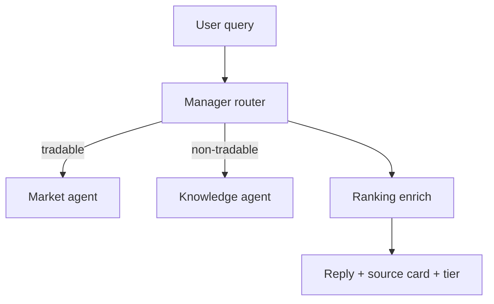

# Phase 2: Manager + Market (deferred)

Phase 1 ships two library agents:

- **Knowledge** — non-tradable WFI corpus via Pinecone + alias index
- **Ranking** — Overframe tier lookup from `data/tier_lists/overframe.json`

## Future manager router



- Tradable slugs route to market agent for prices/parts/orders.
- Non-tradable slugs route to knowledge agent.
- Both paths call `ranking.enrich_response()` for item questions.

## Local testing

```python
from agents.knowledge.agent import answer, retrieve
from agents.ranking.agent import lookup_tier, enrich_response

# Knowledge (needs OPENAI_API_KEY + Pinecone in .env)
result = answer("Tell me about Excalibur")
print(result["reply"])

# Ranking (JSON only, no LLM)
print(lookup_tier("wisp", "warframes"))  # S
enriched = enrich_response({
    "reply": "Wisp is strong.",
    "sources": [{"name": "Wisp", "tier": ""}],
    "resolved_slug": "wisp",
    "equipment_class": "warframes",
})
print(enriched["tier"])
```
