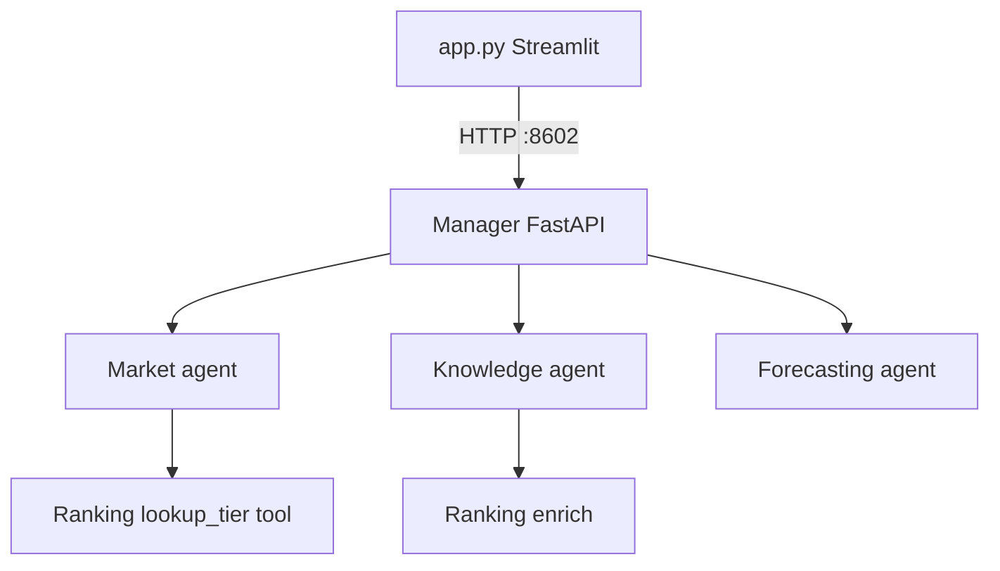

# Architecture

## Manager + subagents

The **Manager** ([`agents/manager/`](agents/manager/)) is a FastAPI server on port **8602**. It orchestrates four library subagents via in-process imports. The **Streamlit UI** ([`app.py`](app.py)) is the product frontend on port **8601**.



### Routing rules

1. **Market** (default) — tradable items on Warframe Market (WFM search hit): live orders, prices, sellers, portfolio.
2. **Knowledge** — WFM search miss: lore, stats, drops from WFI corpus.
3. **Forecasting** — price statistics, history, trends, forecasts (not live order book).
4. **Ranking** — enriches Knowledge replies; Market agent calls `lookup_tier` as a tool.

### Run locally

```bash
uvicorn agents.manager.api:app --host 0.0.0.0 --port 8602
streamlit run app.py
```

## Subagent library usage

```python
from dotenv import load_dotenv
load_dotenv()

from agents.knowledge.agent import answer, retrieve
from agents.ranking.agent import lookup_tier, enrich_response
from agents.market import search, orders, answer as market_answer
from agents.forecasting import forecast_item, ask_market_question
from agents.manager import handle_query

# Direct subagent calls
print(search("mag prime")["results"][0]["slug"])

# Full orchestration (same as POST /query)
print(handle_query("Tell me about Excalibur", "user1", "sess1"))
```
